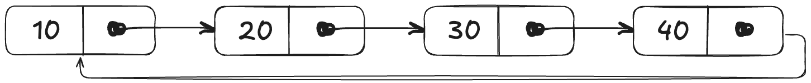
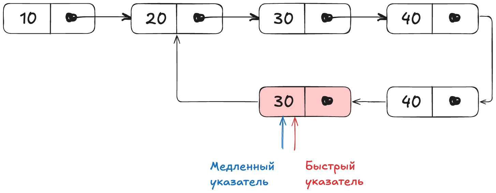

Цикл в связном списке означает, что последний узел связан с каким-нибудь другим узлом **в этом** же связном списке.



Опираясь на вики, цикл в итерируемой последовательность содержит такую пару индексов  _i_ и _j_, что значения по этим индекса равны: $x_i == x_j$.
Возможны две реализации алгоритма.
### Наивная реализация через множество
Опираясь на определение необходимо найти повтор значения в связном списке. Сложность решения O(n) по времени и O(n) по памяти.
```python
def detect_loop_naive(ll: LinkedList) -> bool:
    """Наивная реализация поиска цикла через множество."""
    values = set()
    while ll.head:
        if ll.head in values:
            return True
        values.add(ll.head)
        ll.head = ll.head.next
    return False
```

### Алгоритм Флойда
Для поиска цикла используются два указателя, которые передвигаются по циклу одновременно, но с разными скоростями.
Один указатель (медленный) двигается на один узел вперед, а другой -- на два. 
Если эти указатели встречаются в одном и том же узле, то обнаружен цикл. Если не встречается, то в связанном списке нет цикла. 
Быстрый указатель убегает вперед по списку и, если есть цикл, догоняет медленный указатель.



Возможная реализация с пространственной сложностью O(1) и O(n) по времени.
```python
def detect_loop_floyd(ll: LinkedList) -> bool:
    slow = ll.head
    fast = ll.head

    while slow and fast and fast.next:
        slow = slow.next
        fast = fast.next.next
        if slow == fast:
            return True
    return False
```
