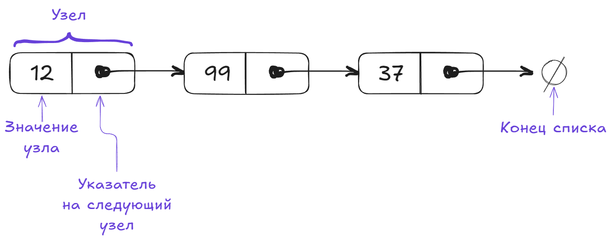

**Связный список** — базовая динамическая структура данных в информатике, состоящая из узлов, содержащих данные и ссылки («связки») на следующий и/или предыдущий узел списка ([wiki](https://ru.wikipedia.org/wiki/%D0%A1%D0%B2%D1%8F%D0%B7%D0%BD%D1%8B%D0%B9_%D1%81%D0%BF%D0%B8%D1%81%D0%BE%D0%BA)).



Реализация списка на Python состоит из двух классов: узел (Node) и сам список (LinkedList), хранящий ссылку на первый узел. Показаны возможные реализации основных операций со списком: добавление узла в конец и начало списка, удаление первого узла, содержащего значение, вывод списка на экран, переворот списка.

```python
from typing import Any
# тут таб, при копировании выглядит желтым, в нижних сниппетах все ок

class Node:
	def __init__(self, data: Any) -> None:
		self.data = data
		self.next = None


class LinkedList:
	def __init__(self):
		self.head = None
	
	def _is_empty(self) -> bool:
		"""Проверка, пустой ли список."""
		return self.head is None
```

- Добавление элемента в конец списка. Создать новый узел, дошагать до конца списка, если он не пустой, прицепить узел в конец.

```python
  class LinkedList:
	...  
    def append(self, data: Any) -> None:
        """Добавление элемента в конец списка."""
        new_node = Node(data)
        if self._is_empty():
            self.head = new_node
            return
        last = self.head
        while last.next:
            last = last.next
        last.next = new_node
```

- Добавление элемента в начало списка. Перестегиваем голову списка на новый элемент

```python
  class LinkedList:
	...  
	def prepend(self, data: Any) -> None:
        """Добавление элемента в начало списка."""
# тут пробелов не хватает
        new_node = Node(data)
        new_node.next = self.head
        self.head = new_node
```

- Отображение элементов списка

Вариантов реализации масса. Тут сожрано (ближе к детям чтобы? они нормальных слов не знают?) O(n) дополнительной памяти для хранения элементов перед выводом. В качестве упражнения попробуйте избавится от этой дополнительной памяти. Обычный проход по всему списку до конца
```python
class LinkedList:
	...
    def display(self) -> None:
        """Отображение элементов списка."""
        elements = []
        current = self.head
        while current:
            elements.append(current.data)
            current = current.next
        print(" -> ".join(map(str, elements)))
```

- Поиск узла по значению

Снова проход по списку до тех пор, пока не встретится искомое. Если не встретилось, вернется `None`
```python
class LinkedList:
	...
    def search(self, key: Any) -> Any | None:
        """Поиск узла по значению."""  # везде были точки, а тут нет
        current = self.head
        while current:
            if current.data == key:
                return current
            current = current.next
        return None
```

- Удаление первого узла, содержащего заданное значение.

```python
class LinkedList:
	...
    def delete(self, key: Any) -> None:
        """Удаление первого узла, содержащего заданное значение."""
        current = self.head

        # Если нужно удалить головной узел
        if current and current.data == key:
            self.head = current.next
            current = None
            return

        # Поиск узла для удаления
        prev = None
        while current and current.data != key:
            prev = current
            current = current.next

        # Если ключ не найден
        if current is None:
            return

        # Удаление узла
        prev.next = current.next
        current = None
```

- Переворот списка. Проход по списку через еще одну временную переменную.

```python
class LinkedList:
	...
    def reverse(self) -> None:
        """Обращение списка.""" # то переворот, то обращение, лучше как-то одно слово я бы Разворот выбрала
        prev = None
        current = self.head
        while current:
            next_node = current.next
            current.next = prev
            prev = current
            current = next_node
        self.head = prev
```

### Сложность
#### Временная сложность

| Чтение | Поиск | Вставка | Удаление |
| :----: | :---: | :-----: | :------: |
|  O(n)  | O(n)  |  O(1)   |   O(n)   |
#### Пространственная сложность
O(n)
